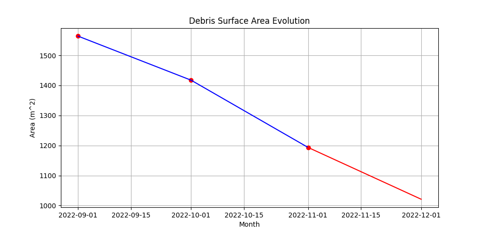

## Example API  microservice 

Microservice for calculation and graphing of devris area.
The service taks sets of images and COCO formatted json files as input and outputs a graph of debris area over time.
Debris area is calculated by converting annotated pixel area to meters squared by analysing EXIF data.

Currently, the service is in MVP stage.
There is no data validation or error handling. It will fail hard if provided with incomplete data

#### #TODO
- [ ] Add unit-tests
- [ ] Add data validation
- [ ] Soft fail if data is incomplete.


#### Future improvemnnts
- Add frontend
- Add persistence (let users upload files one)
- Integrate with DB to record metadata and statistics. 
- Add load balancing and replecation

#### Running service: \
To start the service run `docker-compose up` \

Run the following curl to get an output for sample input
```
curl --location --request POST 'http://0.0.0.0:8000/api/debris/submit' \
--form 'files=@"/Users/konstantintrofimov/PycharmProjects/graphDebris/inputs/11_2022.json"' \
--form 'files=@"/Users/konstantintrofimov/PycharmProjects/graphDebris/inputs/10_2022.json"' \
--form 'files=@"/Users/konstantintrofimov/PycharmProjects/graphDebris/inputs/09_2022.json"' \
--form 'files=@"/Users/konstantintrofimov/PycharmProjects/graphDebris/inputs/DJI_0079 (3).JPG"' \
--form 'files=@"/Users/konstantintrofimov/PycharmProjects/graphDebris/inputs/DJI_0070 (3).JPG"' \
--form 'files=@"/Users/konstantintrofimov/PycharmProjects/graphDebris/inputs/DJI_0062 (3).JPG"'> graph2.png
```

Check grapgh2.png for output
